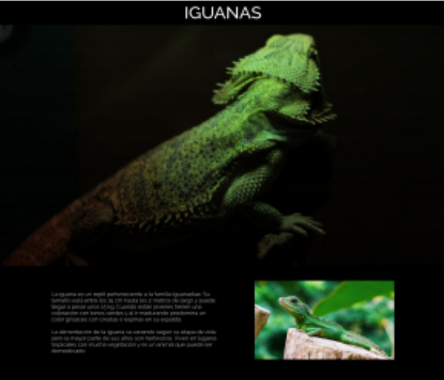
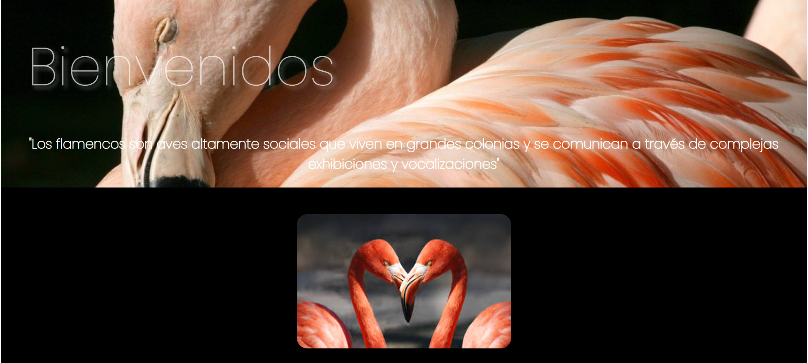
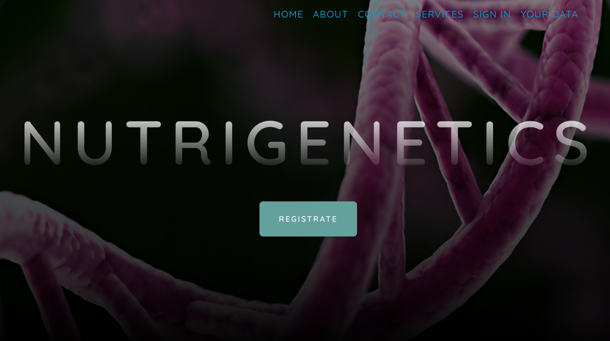

# franciscapr.github.io

# Portafolio de Francisca Paredes

Este es mi portafolio personal, donde muestro mi trabajo como Full Stack Developer y comparto información sobre mí y mis proyectos. ¡Bienvenido!

## Acerca de mí

Soy una entusiasta de la programación y nativa de Viña del Mar. A mis 28 años, he fusionado dos mundos aparentemente diferentes pero increíblemente complementarios: la Nutrición y la Programación. Soy Licenciada en Nutrición y Dietética con un enfoque especial en Nutrigenómica. Mi pasión se extiende al desarrollo web, siendo Ruby on Rails mi herramienta preferida.

## Proyectos Destacados

### Iguana Page - HTML, CSS, Bootstrap, JavaScript

Descripción: Iguana Page fue uno de mis primeros proyectos utilizando maquetación con HTML, CSS, Bootstrap y JavaScript. [Ver proyecto](link-al-proyecto)

### Flanco Page - HTML, CSS, Bootstrap

Descripción: Flanco Page fue otro de mis proyectos de maquetación, utilizando HTML, CSS y Bootstrap. [Ver proyecto](link-al-proyecto)

### Nutrigenetic - Ruby on Rails, PostgreSQL

Descripción: Nutrigenetic es una aplicación web desarrollada con el objetivo de contribuir a la salud y optimizar la nutrición de mis pacientes. [Ver proyecto](link-al-proyecto)

## Contacto

Puedes encontrarme en las siguientes redes:

- [GitHub](https://github.com/franciscapr)
- [Stack Overflow](https://stackoverflow.com/users/tu-usuario)
- [YouTube](https://www.youtube.com/user/tu-canal)
- Email: francisca.paredes.pr@gmail.com
- Teléfono: +569-37123xxx

## Licencia

Este proyecto está bajo la Licencia MIT - consulta el archivo [LICENSE](LICENSE) para más detalles.

---
Diseñado y desarrollado por Francisca Paredes - 2023
